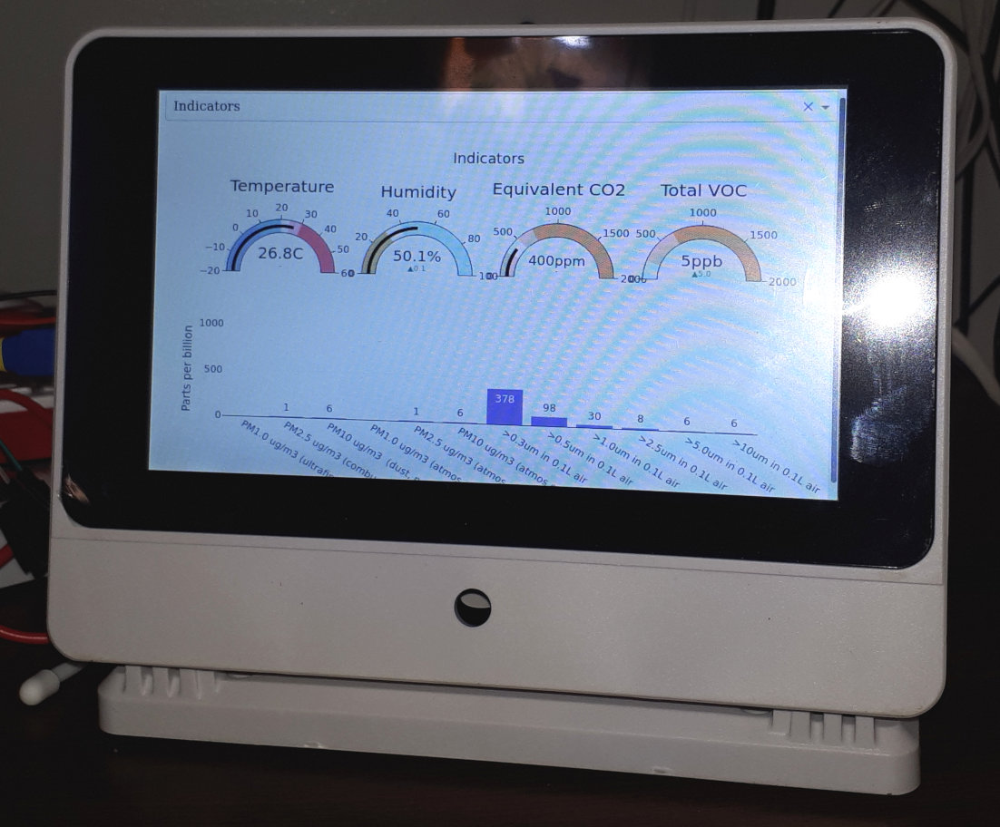

# Sensor Display

## Displaying many sensors simultaneously

This code just logs data from sensors in CSV files and then displays the values in a dash dashboard.

I run it on a Pi4 in a [Smarti Pi](https://smarticase.com/products/smartipi-touch-pro) case with the [official Pi touchscreen](https://www.raspberrypi.com/products/raspberry-pi-touch-display/).

Some features:

  * Data is appended to the CSVs when written, and only the last line is read when read (lighter on the SD card)
  * Systemd services start all of the scripts when the machine starts
  * [Gauge charts are neat](https://plotly.com/python/indicator/)



## Details

### Systemd user services

[This guide](https://github.com/torfsen/python-systemd-tutorial) is fantastic, so have a look!

These services can be configured to start whenever the Raspberry Pi starts. This way your Python scripts can start collecting data, very neat!

The services all start in the user's home directory.

### Appending and reading data

If you're streaming data to a CSV, use the append mode of the `df.to_csv()` function:

```python
df.to_csv("./sensor_display/dht22_data.csv", mode="a", index=False, header=False)
```

When reading the data, there's a [neat trick]() from Stack Overflow to only read the last line:

```python
with open(filename, "rb") as file:
    # Go to the end of the file before the last break-line
    file.seek(-2, os.SEEK_END) 
    # Keep reading backward until you find the next break-line
    while file.read(1) != b'\n':
        file.seek(-2, os.SEEK_CUR) 
    data = file.readline().decode()
data = data.replace("\n", "").split(",")
```
